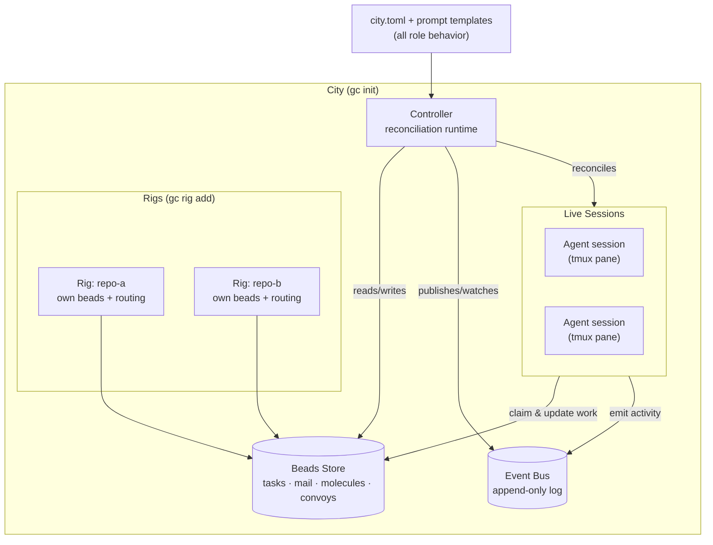
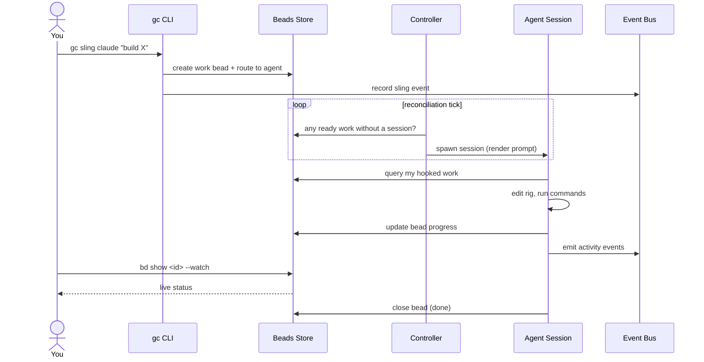

Gas City is an orchestration-builder SDK: a toolkit for composing multi-agent
coding workflows. This page gives you the mental model you need before diving
into the [Tutorials](/tutorials/index) — what the major parts are, how work
travels through the system, and how agents get spawned and talk to each other.

You do **not** need to read any internal engineering notes to follow along.
Everything here maps onto commands you can run with `gc`.

## The core idea: work is the primitive

The single most important thing to understand about Gas City is that
**orchestration is a thin layer on top of work tracking**. The system does not
hardcode any roles — there is no built-in "manager" or "reviewer" baked into
the binary. Instead, every role is supplied as configuration, and the SDK
provides only the infrastructure: a place to store work, a way to run agents,
and a way to observe what happens.

That infrastructure is built from a small set of pieces.

## The major pieces

### City

A **city** is the top-level unit of deployment. Concretely, it is a directory
on disk that contains a `city.toml` config file, a `.gc/` directory of runtime
state, and the rigs you have registered. You create one with `gc init`. A city
has exactly one long-running **controller** process that keeps everything
reconciled.

### Rig

A **rig** is an external project directory registered with the city — usually a
git repository you want agents to work in. Each rig gets its own beads database
and routing context, so work slung inside one rig stays logically isolated from
the others. You add one with `gc rig add <path>`.

### Agent

An **agent** is a configured worker. Agents are pure configuration: a name, the
provider that backs them (for example `claude`), a prompt template that defines
their behavior, and a query that says which work routes to them. Because agents
are configuration, you can define as many as you like, and the SDK never assumes
any particular one exists.

### Session

A **session** is a single running instance of an agent — a live process (by
default a `tmux` pane) that the SDK can start, stop, prompt, and observe.
Sessions are ephemeral: they come and go, crash and get adopted, scale up and
down. The work they were doing survives them, because work lives in the beads
store, not in the session.

### Beads store

The **beads store** is the universal persistence substrate. *Everything* is a
bead: tasks, mail messages, molecules, and convoys are all rows in the same
store. The store offers a single interface — create, read, update, close, list,
query by label, and walk parent/child relationships. By default it is backed by
Dolt through the `bd` CLI. Because all domain state flows through one interface,
the system converges to correct outcomes even as sessions churn.

### Event bus

The **event bus** is the universal observation substrate: an append-only
pub/sub log of everything that happens in the system. It has two tiers —
critical events on a bounded queue for infrastructure, and optional
fire-and-forget events for audit. Other parts of the system watch the bus
reactively rather than polling.

### Controller

The **controller** is the per-city reconciliation runtime — the engine that
drives all infrastructure. On a steady ticker (and whenever `city.toml`
changes) it reconciles the running sessions against the desired config, scales
agent pools, dispatches automations, garbage-collects expired ephemeral work,
and restarts stalled sessions. Crucially, the controller can do all of this
with no user-configured agent running: infrastructure is the SDK's job, and
user agents only execute work.

## How the pieces fit together

Structurally, a city wraps a controller and a beads store, registers one or
more rigs, and runs agents as live sessions. The event bus sits alongside as
the observation channel everything writes to.



Notice what the diagram does *not* contain: any specific role. The controller
reconciles whatever agents the config declares. Remove an agent from
`city.toml` and the infrastructure keeps working — only that agent's work stops
flowing.

## End-to-end: the life of a piece of work

Here is how a single request travels through the system, from the command line
to a finished result.

1. **You sling work.** `gc sling <agent> "<description>"` creates a work item —
   a bead — and routes it by running the target agent's routing query (which
   typically just assigns or labels the bead).
2. **The controller notices.** On its next reconciliation tick, the controller
   sees there is ready work routed to an agent that has no live session.
3. **A session is spawned.** The controller starts the agent's session through
   its runtime provider, rendering the agent's prompt template to tell it what
   it does.
4. **The agent finds its work.** Following the system's "if it's on your hook,
   run it" principle, the agent queries the beads store for the work routed to
   it and begins executing — editing files in the rig, running commands, and so
   on.
5. **Progress is recorded.** The agent updates the bead as it works and emits
   events on the bus; observers (including you, via `bd show --watch`) see the
   live state.
6. **Work completes.** The agent closes the bead. The session may shut down or
   stay warm for the next item; either way the result persists in the store.



## Agent spawning, lifecycle, and communication

**Spawning.** Agents are never started by name in Go code. The controller spawns
a session when reconciliation determines one is needed — for a fixed agent
declared in config, or for an additional pool instance when an agent's pool
`check` command reports more work. The prompt template is rendered at spawn time
and is the entire behavioral specification for that session.

**Lifecycle.** Sessions are designed to be disposable. The controller probes
them for liveness, and if one stalls it can restart it with backoff. If a
session crashes, the controller can adopt or replace it. Because the work is a
bead and the assignment is a hook on that bead, nothing is lost when a session
dies — a fresh session picks up exactly where the work record says to.

**Communication.** Agents coordinate through two derived mechanisms, neither of
which is a new primitive:

- **Mail** is just a bead with a `message` type. An agent's inbox is a query for
  open message beads addressed to it; archiving a message is closing that bead.
- **Nudge** is a session-layer operation: text typed directly into a running
  agent's session to prod it. It is fire-and-forget.

Both reduce to the two primitives you already met — mail is the beads store,
nudge is the session. There is nothing else to learn.

## A runnable example

Everything above is reachable from a handful of commands. This is the smallest
end-to-end path — create a city, register a rig, route work, and watch it run:

```bash
# 1. Create and start a city (controller comes up automatically)
gc init ~/bright-lights
cd ~/bright-lights

# 2. Register a project directory as a rig
mkdir ~/hello-world && cd ~/hello-world && git init && cd -
gc rig add ~/hello-world

# 3. Sling a work item to an agent — this creates a bead and routes it
cd ~/hello-world
gc sling claude "Create a script that prints hello world"

# 4. Watch the work bead progress as the agent executes it
bd show <bead-id> --watch
```

If `gc` opens a git commit editor instead of running, see the Oh My Zsh note in
[Troubleshooting](/getting-started/troubleshooting#oh-my-zsh-git-plugin-hides-gc).
You will need `gc`, `tmux`, `git`, `jq`, and a beads provider installed first —
the [Installation](/getting-started/installation) page covers the toolchain.

## Where to go next

- [Quickstart](/getting-started/quickstart) — the same path above, in a few
  minutes.
- [Tutorial 01: Cities and Rigs](/tutorials/01-cities-and-rigs) — start the
  guided, end-to-end walkthrough that teaches the full user model.
- [Tutorial 06: Beads](/tutorials/06-beads) — go deeper on the work store that
  underpins everything here.
- [Beads Storage Topology](/internals/beads-topology) — how a city and its rigs
  share one store under the hood.
- [Reference](/reference/index) — command, config, formula, and provider lookup.
</content>
</invoke>
