This page renders the same four diagrams in three different tools so they can be compared visually.

- **Mermaid** is rendered inline by Mintlify's `mermaid` code block.
- **D2** sources live under `docs/diagrams-comparison/d2/` and are compiled to SVG with `make diagrams-d2`. Compiled SVGs are committed under `docs/diagrams-comparison/d2-rendered/`.
- **Excalidraw** sources live under `docs/diagrams-comparison/excalidraw/` and are rendered to SVG with `make diagrams-excalidraw` (uses `@swiftlysingh/excalidraw-cli`). Compiled SVGs are committed under `docs/diagrams-comparison/excalidraw-rendered/`.

Run `make diagrams` to (re-)render everything.

## A. Simple flowchart — user login

Tests basic shapes, branching, and labels.

### Mermaid

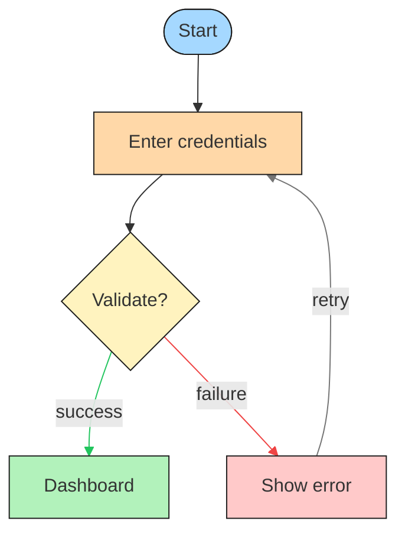

### D2

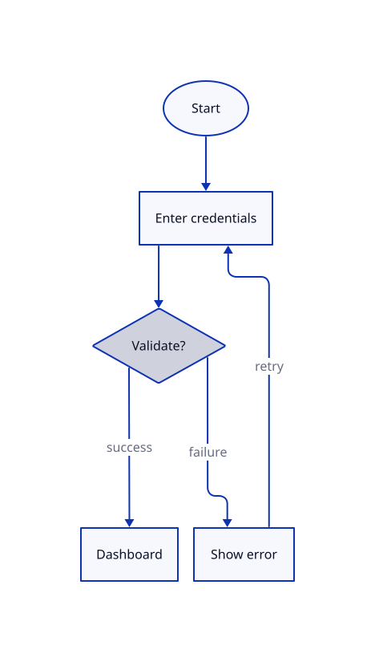

### Excalidraw

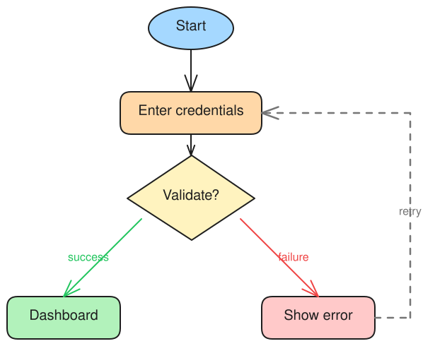

## B. System architecture — small web app

Tests containers/grouping and dense layouts: browser → CDN → load balancer → two app server instances → primary DB + read replica + Redis cache. App servers and data layer are grouped.

### Mermaid

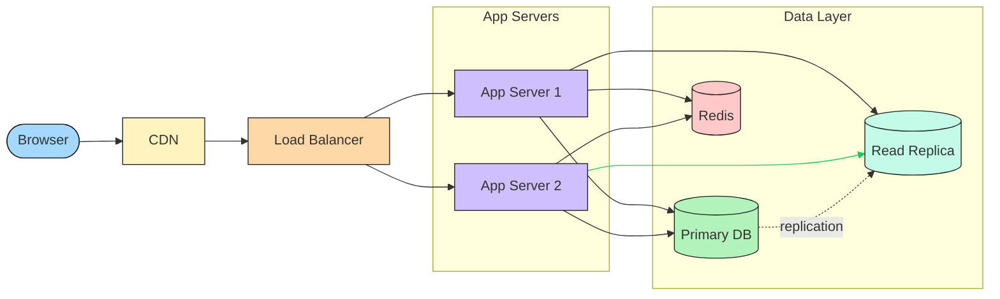

### D2

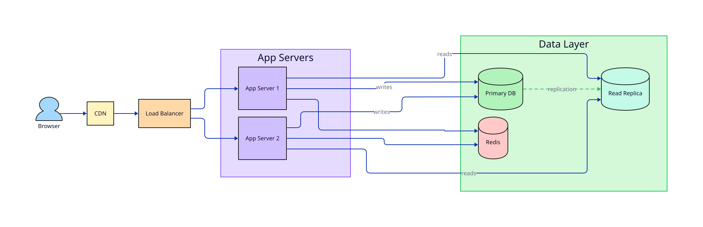

### D2 (sketch mode)

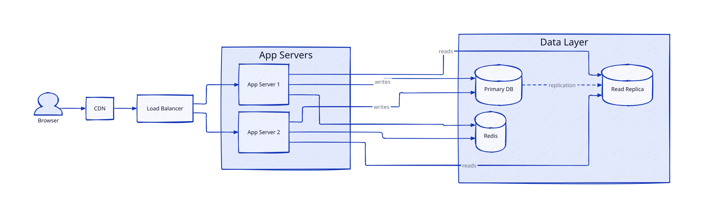

### Excalidraw

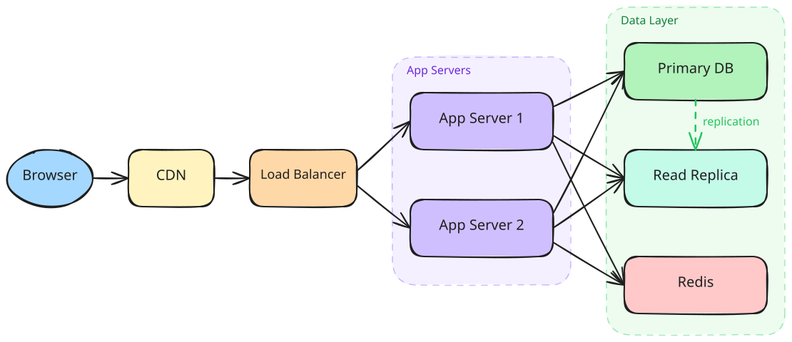

## C. Sequence diagram — OAuth 2.0 authorization code

Tests how each tool handles sequence/interaction diagrams. Mermaid and D2 both support sequence diagrams natively. Excalidraw has no native sequence syntax, so the version below is a hand-built swim-lane approximation (4 actors with vertical lifelines and labeled message arrows).

### Mermaid

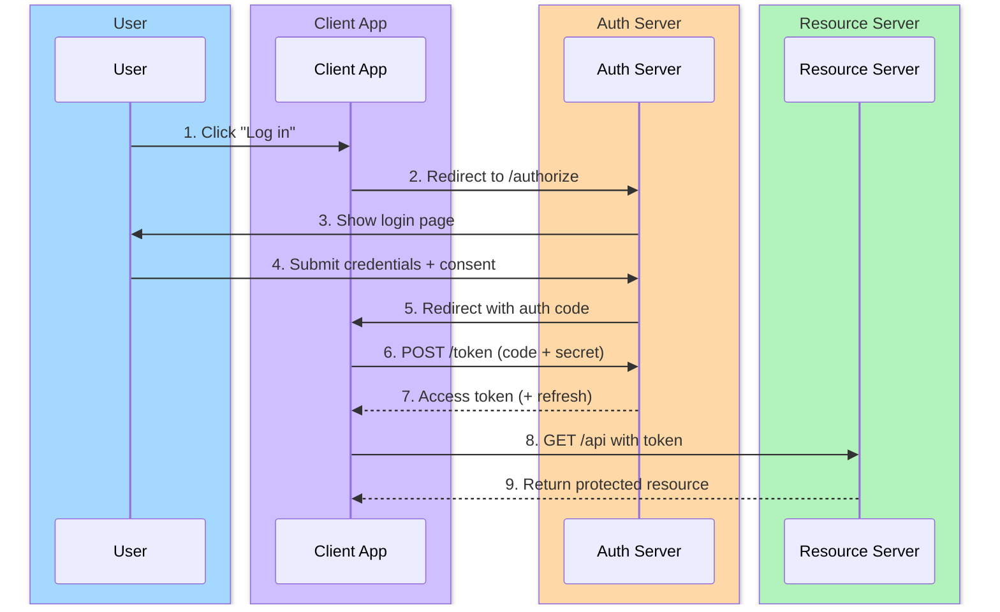

### D2

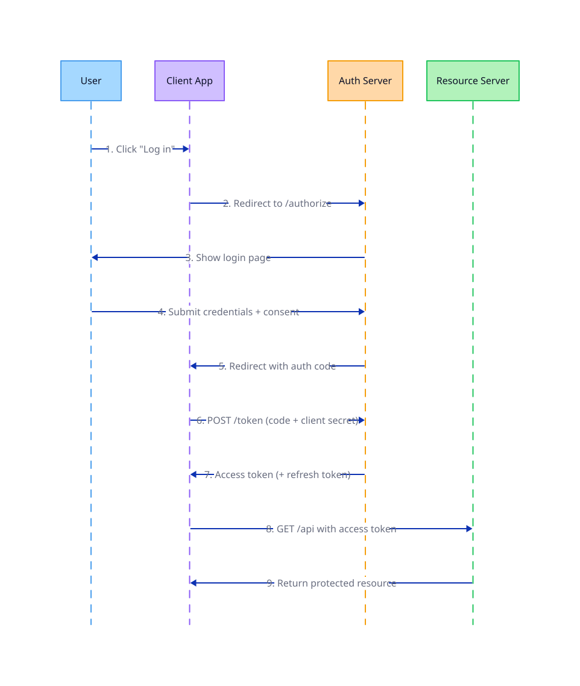

### Excalidraw

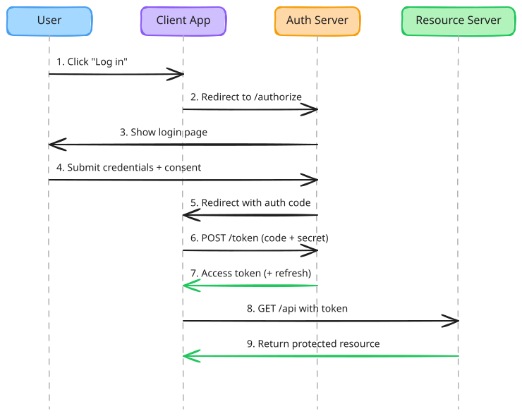

## D. ER-style data model — User / Order / Product

Tests how each tool handles structured data shapes: three entities with fields and relationships.

### Mermaid

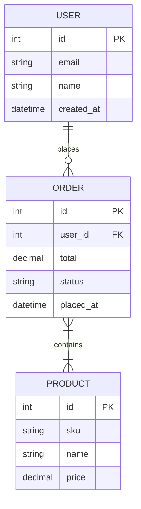

### D2

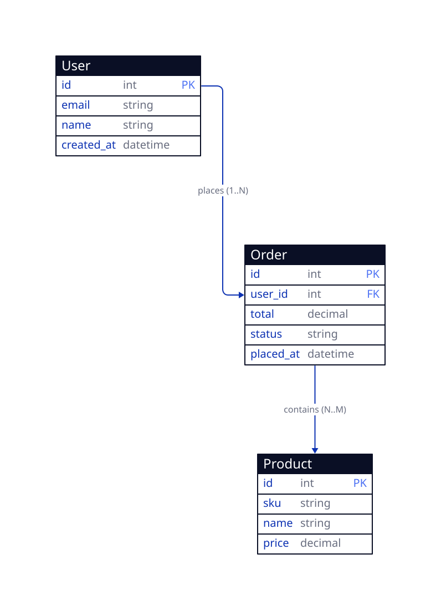

### Excalidraw

Excalidraw has no native ER table shape — the version below is a hand-built approximation using a colored header band over a list of text rows. The PK/FK markers are inline labels.

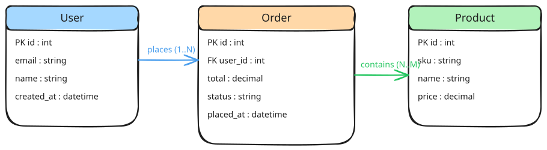

## Summary

Numbers for **diagram B** (architecture diagram — the densest of the four):

| Tool | Source lines (B) | Build step? | Rendered output size (B) |
| --- | --- | --- | --- |
| Mermaid | 22 (inline in this .mdx) | No — rendered live by Mintlify | n/a (inline SVG, no committed file) |
| D2 | 30 | Yes — `make diagrams-d2` | 31 KB SVG |
| D2 (sketch mode) | 36 | Yes — `make diagrams-d2` | 126 KB SVG |
| Excalidraw | 478 | Yes — `make diagrams-excalidraw` | 28 KB SVG |
